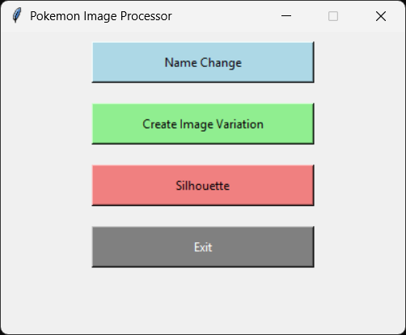

<div align="center">

# 🖼️ Pokémon Image Processor

**A handy desktop tool for batch-processing Pokémon card images.** 🎴

Rename files, generate image variations, and create silhouettes — all through a simple Tkinter GUI.



</div>

---

## ✨ Features

| | |
|---|---|
| 🔢 **Remove Leading Numbers** | Renames files by removing leading numbers from filenames |
| 🎨 **Create Image Variations** | Generates black and not-black versions of each image in the folder |
| 👤 **Generate Silhouettes** | Converts black images into silhouette versions |
| 🖱️ **User-Friendly GUI** | Easily select and process image folders using buttons |

---

## 🚀 Getting Started

### Prerequisites

- 🐍 Python 3.7 or higher
- Required libraries:
  - `tkinter`
  - `Pillow`

Install the dependencies:
```bash
pip install pillow
```

### Installation & Run

1. **Clone the repo**
   ```bash
   git clone <repository-url>
   cd <repository-folder>
   ```

2. **Run it**
   ```bash
   python poke_img_processor.py
   ```

3. **Select an option from the GUI menu** 🎉
   - **✏️ Name Change** — remove leading numbers from filenames
   - **🎨 Create Image Variation** — generate black and not-black variations
   - **👤 Silhouette** — create silhouette images from black variations

4. **Follow the prompts** to select the folder containing your images

---

## 🖥️ GUI Overview

| Option | Description |
|---|---|
| ✏️ **Name Change** | Removes leading numbers from filenames |
| 🎨 **Create Image Variation** | Adds variations of the selected images |
| 👤 **Silhouette** | Converts black variations into silhouette images |
| 🚪 **Exit** | Closes the application |

---

## 🗂️ File Structure

```
image-processor/
└── poke_img_processor.py   # 🧠 Main application script
```

---

## 🙏 Acknowledgments

- Built with ❤️ for simplifying image processing workflows
- Powered by 🐍 Python and `tkinter`
- Shoutout to **Slugiish_** for the image uploads on Reddit 🙌
